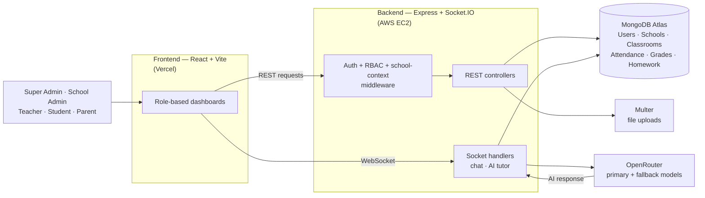
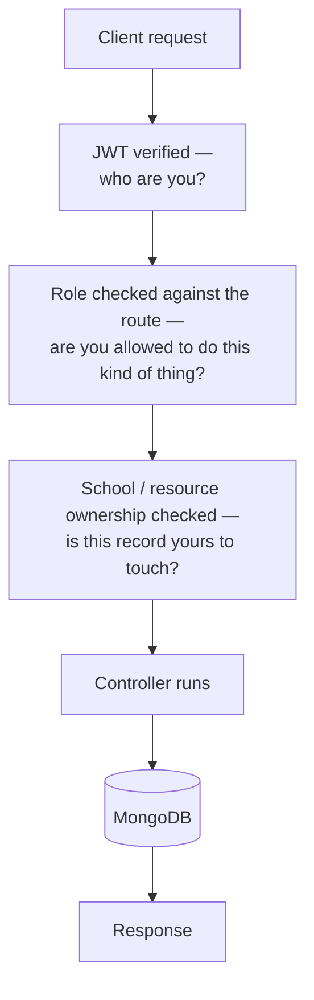
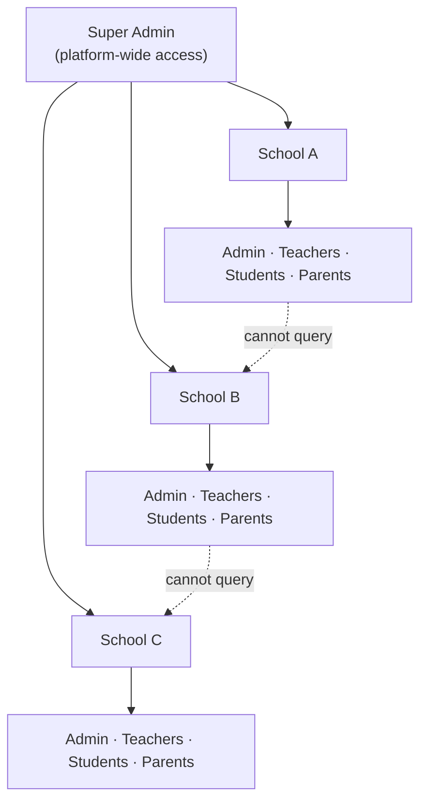
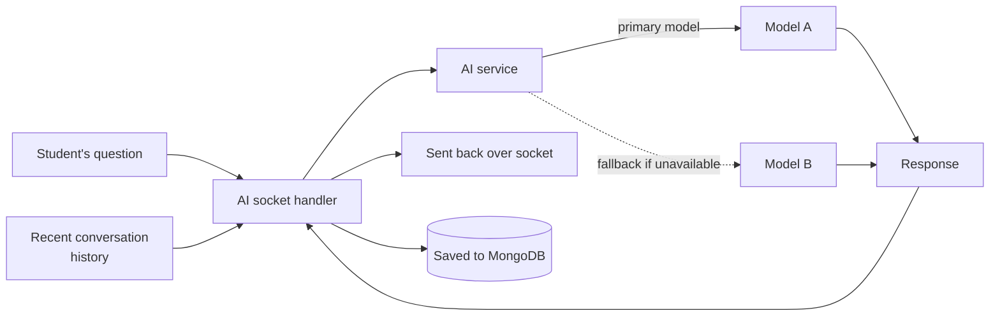

<div align="center">

# 🏫 EduManage

**A complete school management system — attendance, homework, grades, timetables, and messaging, in one place for admins, teachers, students, and parents.**

[](https://edumanageai.vercel.app/)


**[🌐 Live Demo](https://edumanageai.vercel.app/)** · **[💻 Repo](https://github.com/tassu1/EduManage)** · **[🐛 Report Bug](https://github.com/tassu1/EduManage/issues)**

</div>

---

## What is EduManage?

Most schools run their day-to-day work on a mix of paper registers, printed report cards, notice boards, and WhatsApp groups. Attendance gets marked in a notebook. Grades get typed up separately. A parent finds out about their child's performance only at a parent-teacher meeting, weeks after the fact. Nothing is in one place, and no two people are looking at the same up-to-date information.

**EduManage replaces all of that with one website.** A school signs up, and from then on:

- **Admins** manage teachers, students, classrooms, timetables, and exams for their school.
- **Teachers** mark attendance, assign homework, and enter grades — all online, updated instantly.
- **Students** log in and see their own timetable, homework, and grades the moment they're posted, and can ask an AI tutor for help when they're stuck.
- **Parents** log in and see exactly what their child's teacher sees — attendance, grades, progress — without waiting for a meeting, and can message the teacher directly.

Everyone is looking at the same live data, just filtered to what's relevant to them — and one platform can run any number of schools at once, each one's data kept completely separate from the others.

### Why it exists

This was built to solve a real, unglamorous problem: school administration doesn't need to be reinvented, it needs to be *centralized*. The interesting engineering problem underneath that simple idea is access control — five very different people need five very different views of the same data, and none of them should ever be able to see another school's information or another role's permissions by accident. That's the problem EduManage is actually built around solving.

---

## Features

- **Five role-based dashboards** — Super Admin, School Admin, Teacher, Student, Parent — each seeing only what they're supposed to
- **Multi-school support**, with strict data isolation enforced on the backend, not just hidden in the interface
- **Full academic workflow** — classrooms, timetables, exam schedules, attendance, homework, submissions, grading
- **Real-time messaging** between teachers, students, and parents via Socket.IO, with typing indicators
- **AI tutor** for students, backed by OpenRouter with automatic fallback if the primary model is unavailable
- **Analytics** at the platform level (Super Admin), school level (School Admin), and individual level (Student)
- **JWT authentication + bcrypt password hashing**, with authorization middleware guarding every protected route

---

## Tech Stack

<table>
<tr>
<td valign="top">

**Frontend**
- React 19 + Vite
- React Router
- Axios
- Socket.IO Client
- Tailwind CSS

</td>
<td valign="top">

**Backend**
- Node.js + Express 5
- MongoDB + Mongoose
- Socket.IO
- JWT + bcryptjs
- Multer

</td>
<td valign="top">

**AI & Hosting**
- OpenRouter (primary + fallback models)
- Frontend → **Vercel**
- Backend → **AWS EC2** (Amazon Linux 2023)
- Database → **MongoDB Atlas**

</td>
</tr>
</table>

> The backend isn't just deployed to a managed platform like Vercel or Render — it runs on a self-provisioned **AWS EC2** instance, set up and configured from scratch (SSH access, Node install, process management, security group/port configuration). See [Deployment](#deployment) below for the exact steps.

---

## Architecture



Everything a browser sends — REST or WebSocket — lands on the same Express process running on EC2. REST requests go through the auth/RBAC/school-context middleware chain before reaching a controller; Socket.IO connections carry their own auth handshake and route straight to the chat or AI-tutor handler, since those need to push data back without the client asking again.

### Request & authorization flow



Three checks, in that order, on every protected route. Drop any one of them and either an unauthenticated request gets through, or a School Admin from one school can reach into another's data.

### Multi-school isolation



Every school-scoped document carries the owning school's ID, and every query is filtered by the requester's own `schoolId` before it runs — isolation is a property of the query, not a UI convention. Only the Super Admin's role crosses the school boundary.

### AI tutor pipeline



A student's question goes to the socket handler along with recent conversation history for context, gets routed through OpenRouter (falling back to a secondary model if the primary is unavailable), and streams back over the same socket connection. Conversations are persisted so a student can pick up a learning thread later.

---

## Project Structure

```
EduManage/
├── backend/
│   ├── server.js              # Express app + Socket.IO setup, route mounting
│   ├── config/db.js            # Mongoose connection
│   ├── controllers/            # Business logic per route
│   ├── middleware/             # JWT auth, role checks, school-context checks
│   ├── models/                 # User, School, Classroom, Attendance, Grade, Homework, ...
│   ├── routes/                 # auth, superAdminRoutes, schoolAdminRoutes,
│   │                            #   teacherRoutes, studentRoutes, parentRoutes
│   └── socketHandlers/         # aiSocketHandler, chatSocketHandler
└── frontend/
    └── src/
        ├── components/
        ├── pages/               # One set of pages per role dashboard
        └── services/             # API client, socket client
```

Route groups mounted in `server.js`: `/api/auth`, `/api/super`, `/api/school-admin`, `/api/teacher`, `/api/student`, `/api/parent` — one route file per role.

---

## Deployment

- **Frontend** → Vercel (static Vite build)
- **Backend** → **AWS EC2**, Amazon Linux 2023, Node.js — provisioned and configured manually (no managed PaaS)
- **Database** → MongoDB Atlas

Backend deployment steps: provision the EC2 instance → connect over SSH → install Git and Node.js → clone the repo → set the environment variables below → run the Express server → open the port in the EC2 security group → point the Vercel frontend's API URL at the EC2 public address.

```
Users → Vercel (frontend) → HTTP / WebSocket → AWS EC2 (Express + Socket.IO) → MongoDB Atlas
```

---

## Running It Locally

You'll need Node 18+, a MongoDB instance (local or [Atlas](https://www.mongodb.com/atlas)), and an [OpenRouter](https://openrouter.ai/) API key.

```bash
git clone https://github.com/tassu1/EduManage.git
cd EduManage
```

**Backend:**
```bash
cd backend
npm install
```
Create `backend/.env`:
```env
PORT=5000
MONGO_URI=your_mongodb_connection_string
JWT_SECRET=your_jwt_secret
OPENROUTER_API_KEY=your_openrouter_api_key
```
```bash
npm run dev
```

**Frontend**, in a second terminal:
```bash
cd frontend
npm install
npm run dev
```

The app runs at `http://localhost:5173`. Never commit real credentials to the repo.

---

## Roadmap

- [ ] Tests around the RBAC middleware — this is the piece where a bug becomes a data-isolation problem, not just a broken feature
- [ ] Docker for the backend, for consistent local setup
- [ ] CSV bulk import for onboarding a school's existing student/teacher roster
- [ ] CI checks on PRs

Ideas or bugs → [open an issue](https://github.com/tassu1/EduManage/issues).

---

## Contributing

Fork it, branch off, run both `backend` and `frontend` locally per the steps above, and open a PR. If you're touching permissions, test the role you *didn't* mean to affect — a School Admin change that accidentally loosens what a Teacher can reach is the easiest mistake to make in a codebase shaped like this one.

---

## Author

Built by **Tahseen** ([@tassu1](https://github.com/tassu1)) — [Portfolio](https://tassu1.vercel.app/)
